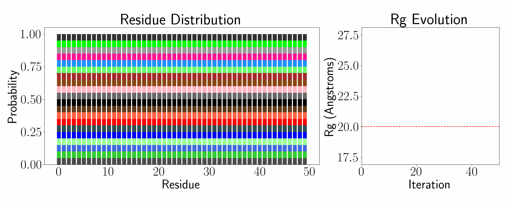

# idp-design

This repository contains code corresponding to the paper titled "Generalized design of sequence-ensemble-function relationships for intrinsically disordered proteins." We provide code corresponding to two example optimizations -- radius of gyration (Rg) and salt sensor optimizations. Additional code is available upon request, and will be made public given sufficient demand.

## Usage

All design scripts save results in a specified directory in an `output` directory. Before you design any IDPs, please `cd path/to/idp-design && mkdir output`.

To design an IDP with a target Rg, simply run:
`python3 -m experiments.design_rg --run-name <RUN-NAME> --seq-length <LENGTH> --target-rg <TARGET-VALUE>`
where `TARGET-VALUE` is the target Rg (in Angstroms) and `LENGTH` is the length of the IDP. Results will be stored in `output/RUN-NAME`.

To design an IDP that either expands or contracts depending on changes in salt concentration, run
`python3 -m experiments.design_rg_salt_sensor --run-name <RUN-NAME> --seq-length <LENGTH> --salt-lo 150 --salt-hi 450 --mode MODE`
where `MODE` is either `expander` or `contractor` and `LENGTH` is the length of the IDP. Results will be stored in `output/RUN-NAME`.
By default, the low and high salt concentrations are 150 mM and 450 mM but these can be changed with the `--salt-lo` and `--salt-hi` arguments.
